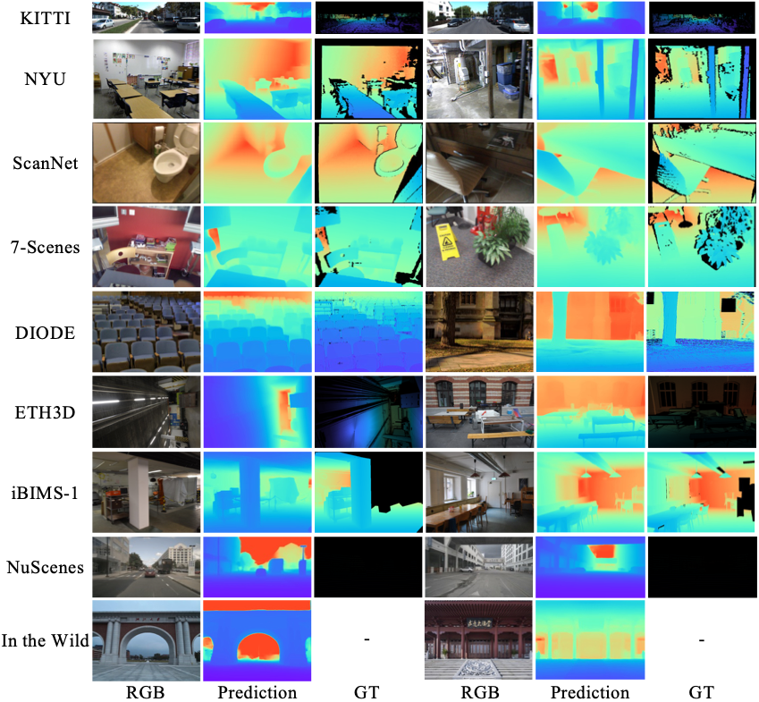
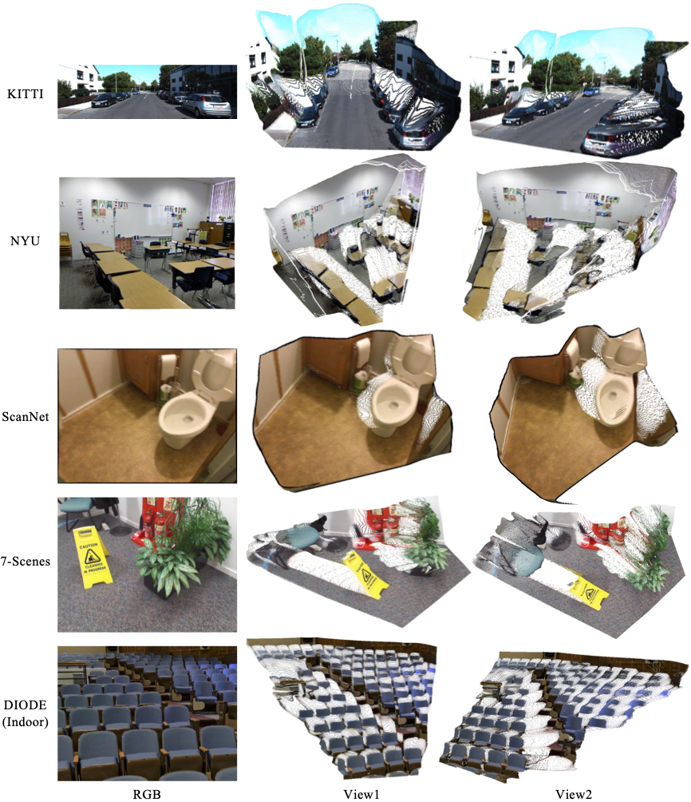
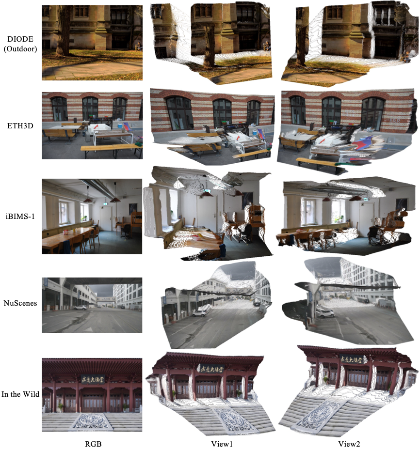

# Depth3D: A Model Zoo for Robust Monocular Metric Depth Estimation

Depth3D aims at robust monocular metric depth estimation on zero-shot testing images, while ensuring the geometric accuracy of unprojected 3D point cloud. We release models of BEiT-L, ConvNext-L, and Swin2-L trained on 11.8 million RGB-D data. The technical report is avaliable in ```Depth3D/technical_report_v1.1.pdf```.

## Dataset and Weight Download
Download all the folders including ```datasets```, ```weights```, ```pretrained_weights```, ```weights_ablation```, and place them under ```Depth3D/```. The download link is as follows:

Baidu Netdisk: ```链接(Download link): https://pan.baidu.com/s/1ISB0kOooYz5QMttmHAd5cA?pwd=qr8q 提取码(Passcode): qr8q```

### The Components of Each Folder
```bash
- datasets # The test datasets, we provide kitti, nyu, scannet, 7scenes, diode, eth3d, ibims, and nuscenes.
- pretrained weights # pre-trained weights, which are adopted for training depth models.
	- convnext_large_22k_1k_384.pth # Weight of ConvNext-L pre-trained on ImageNet-22k and fine-tuned on ImageNet-1k at resolution 384x384.
	- dpt_beit_large_512.pt # The highest quality affine-invariant depth model of BEiT-L trained by MiDaS 3.1 (https://github.com/isl-org/MiDaS/tree/master).
	- dpt_swin2_large_384.pt # The speed-performance trade-off affine-invariant depth model of Swin2-L trained by MiDaS 3.1.
- weights # Our released models, we leverage around 12 million RGB-D data for training.
	- metricdepth_beit_large_512x512.pth # BEiT-L depth model trained on the resolution of 512x512. Best Performance.
	- metricdepth_convnext_large_544x1216.pth # ConvNexrt-L depth model trained on the resolution of 544x1216.
	- metricdepth_swin2_large_384x384.pth # Swin2-L depth model trained on the resolution of 384x384. Balance between speed and quality.
- weights_ablation # Checkpoints of ablation study
	- ablation_full.pth # Full baseline of ablation study. Trained with 21 datasets, 7 losses, and supervised in the camera canonical space.
	- ablation_data_6_datasets.pth # Compared to ablation_full.pth, only trained on 6 datasets.
	- ablation_data_13_datasets.pth # Compared to ablation_full.pth, only trained on 13 datasets.
	- ablation_loss_l1_sky.pth # Compared to ablation_full.pth, only supervised with "L1Loss" and "SkyRegularizationLoss".
	- ablation_loss_l1_sky_normal.pth # Compared to ablation_full.pth, only supervised with "L1Loss" and "SkyRegularizationLoss", "VNLoss", "EdgeguidedNormalLoss", "PWNPlanesLoss".
	- ablation_wo_lablescalecanonical.pth # Compared to ablation_full.pth, it does not transform the camera to the canonical space, which results in unsatisfactory metric depth performance.
```

## Reproducing the Results of the Technical Report
To reproduce the results, please run the scripts of ```Depth3D/scripts/technical_report```. 
For example. if you would like to reproduce the Table 3, run this commmand: ```python scripts/technical_report/run_table3.py```. It will take hours of time to output the final results.
See ```scripts/technical_report/README.md``` for details.

## Structure of Code
```python
- Depth3D
	- data_info
		- check_datasets.py
		- pretrained_weight.py # pretrained weight path of backbone.
		- public_datasets.py # path of annotations of diverse datasets.
	- datasets
		- ibims
			- ibims
			- test_annotation.json
		- diode
			- diode
			- test_annotation.json
			- test_annotation_indoor.json
			- test_annotation_outdoor.json
		- ETH3D
			- ETH3D
			- test_annotations.json
		...
	- demo_data # demo data of technical report.
	- mono
		- configs # configs of training and evaluation.
		- datasets # torch.utils.data.Dataset.
		- model # depth models.
		- tools
		- utils
	- other_tools
	- pretrained_weights # pretrained weights, used for training depth models.
	- scripts # scripts of training and testing
		- ablation 
			- test
			- train
		- technical_report # scripts to reproduce the results of technical report.
		- test
		- train
	- show_dirs # output folder of inference.
	- weights # place our trained depth models here.
	- weights_ablation # place our released depth models of ablation study here.
	- work_dirs # output folder of training.
```


## Installation
```bash
conda create -n Depth3D python=3.7
conda activate Depth3D
pip install torch==1.10.0+cu111 torchvision==0.11.0+cu111 -f https://download.pytorch.org/whl/torch_stable.html
pip install -r requirements.txt
pip install -U openmim
mim install mmengine
mim install "mmcv-full==1.3.17"
pip install yapf==0.40.1
```

### For 40 Series GPUs
```bash
conda create -n Depth3D python=3.8
conda activate Depth3D
pip install torch==2.0.0 torchvision==0.15.1
pip install -r requirements.txt
pip install -U openmim
mim install mmengine
mim install "mmcv-full==1.7.1"
pip install yapf==0.40.1
```

## Evaluation of a Specific Dataset
### Case 1: Metric Depth Estimation of Our Provided Test Datasets
```bash
source scripts/test/beit/test_beit_nyu.sh # change the shell file path if necessary.
```

If you would like to evaluate on a customized dataset, let's take ```"demo_data"``` as an example:

### Case 2: Metric Depth Estimation of Customized Data

1. Generate ```test_annotation.json``` of customized dataset:
```python
dict(
	'files': [
		dict('cam_in': [fx, fy, cx, cy], 'rgb': 'demo_data/rgb/xxx.png', (optional) 'depth': 'demo_data/gt_depth/xxx.npy', (optional) 'depth_scale': 1.0, (optional) 'depth_mask': 'demo_data/gt_depth_mask/xxx.npy'), 
		dict('cam_in': [fx, fy, cx, cy], 'rgb': 'demo_data/rgb/xxx.png', (optional) 'depth': 'demo_data/gt_depth/xxx.png', (optional) 'depth_scale': 256.0, (optional) 'depth_mask': null), 
		dict('cam_in': [fx, fy, cx, cy], 'rgb': 'demo_data/rgb/xxx.png', (optional) 'depth': 'demo_data/gt_depth/xxx.png', (optional) 'depth_scale': 1000.0, (optional) 'depth_mask': null), 
		...
	]
)
```
See ```Depth3D/demo_data/test_annotations.json``` for details. The ```depth``` and ```depth_scale``` are necessary if evaluation is expected. The ```depth_scale``` stands for the depth scale ratio of depth image. The ```depth_mask``` is used to filter out invalid depth regions, with 0 for invalid regions and others for valid regions.

We store the relative file path in the annotation. For example, if the RGB file path is ```/mnt/nas/share/home/xugk/Depth3D/demo_data/rgb/0016028039294718_b.jpg```, we save the relative path ```demo_data/rgb/0016028039294718_b.jpg```, and set parameters ```"$DATA_ROOT"``` to ```"/mnt/nas/share/home/xugk/Depth3D/"```(See step 2 below).

2. Inference with this script:
```bash
DEPTH3D_TEST_ANNO_PATH='demo_data/test_annotations.json'
DATA_ROOT='/mnt/nas/share/home/xugk/Depth3D/'
source scripts/inference/inference_metric_depth.sh $TEST_ANNO_PATH $DATA_ROOT
```

If the absolute file paths are saved in ```test_annotation.json```, you can simply input the ```"$TEST_ANNO_PATH"``` only:
```bash
TEST_ANNO_PATH='demo_data/test_annotations_absolute_path.json'
source scripts/inference/inference_metric_depth.sh $TEST_ANNO_PATH
```


3. The output depth maps and point clouds are saved in ```Depth3D/outputs_beit_metric_depth```.

### Case 3: Scale-invariant Depth Estimation of Customized Data (In the Wild Images, Unknown Focal Length)

Assuming the path of RGB folder is ```"demo_data/rgb/"```:
```bash
RGB_FOLDER='demo_data/rgb/'
source scripts/inference/inference_in_the_wild.sh $RGB_FOLDER
```
The output depth maps and point clouds are saved in ```Depth3D/outputs_beit_in_the_wild```.

## Dataset Structure
We use the *_annotation.json files to store the camera intrinsic information and the paths of rgb, depth, etc. The data structure is as follows:

```bash
- Taskonomy
	- Taskonomy
		- (optional) meta # save the pickle files, see 'Format 1' for details
		- rgb
		- depth
		- (optional) sem
		- (optional) normal
	- test_annotation.json # test annotation file
	- train_annotation.json # train annotation file
```

### Format 1
The format of *_annotation.json files：
```python
dict(
	'files': [
		dict('cam_in': [fx, fy, cx, cy], 'rgb': 'Taskonomy/rgb/xxx.png', 'depth': 'Taskonomy/depth/xxx.png', (optional) 'sem': 'Taskonomy/sem/xxx.png', (optional) 'normal': 'Taskonomy/norm/xxx.png'),
		dict('cam_in': [fx, fy, cx, cy], 'rgb': 'Taskonomy/rgb/xxx.png', 'depth': 'Taskonomy/depth/xxx.png', (optional) 'sem': 'Taskonomy/sem/xxx.png', (optional) 'normal': 'Taskonomy/norm/xxx.png'),
		dict('cam_in': [fx, fy, cx, cy], 'rgb': 'Taskonomy/rgb/xxx.png', 'depth': 'Taskonomy/depth/xxx.png', (optional) 'sem': 'Taskonomy/sem/xxx.png', (optional) 'normal': 'Taskonomy/norm/xxx.png'),
		...
	]
)
```

### Format 2
The format of *_annotation.json files：
```python
dict(
	'files': [
		dict('meta_data': 'Taskonomy/xxx/xxx.pkl'),
		dict('meta_data': 'Taskonomy/xxx/xxx.pkl'),
		dict('meta_data': 'Taskonomy/xxx/xxx.pkl'),
		...
	]
)
```


The format of 'xxx.pkl'：
```python
dict(
	'cam_in': [fx, fy, cx, cy],
	'rgb': 'Taskonomy/rgb/xxx.png',
	'depth': 'Taskonomy/depth/xxx.png',
	(optional) 'sem': 'Taskonomy/sem/xxx.png'
	(optional) 'normal': 'Taskonomy/norm/xxx.png',
)
```

## Demos

### Monocular Depth Estimation
<div align=center>

</div>

### Unprojected 3D Point Cloud
<div align=center>

</div>

<div align=center>

</div>


## 🎫 License
For non-commercial academic use, this project is licensed under [the 2-clause BSD License](https://opensource.org/license/bsd-2-clause). 
For commercial use, please contact [Chunhua Shen](mailto:chhshen@gmail.com).

