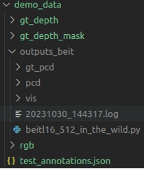
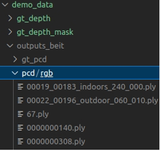
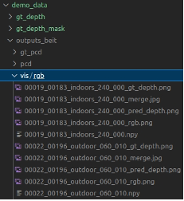
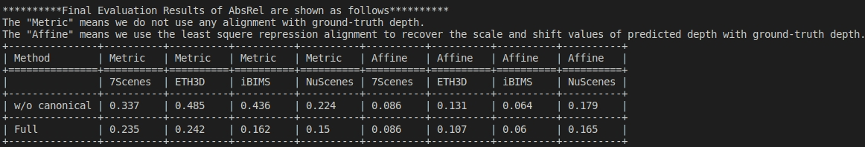

# Reproduction of Experiments in Depth3D

## Figure 4-6
In order to visualize the qualitative depth estimation results, please run the script below. It runs monocular depth estimation on 18 demo images, which contains two images for each of 8 test datasets and another two "In the Wild" images.  
```bash
cd Depth3D/
source scripts/technical_report/run_figure4-6.sh
```

The images in Figure 4 can be found in ```Depth3D/demo_data/outputs_beit/vis/rgb/```, and those in Figure 5 and 6 can be found in ```Depth3D/demo_data/outputs_beit/pcd/rgb/```. We use the MeshLab software to render the pointcloud to 2D images.

The output is summarized as follows:

<div align=center>
    
</div>


## Table 3-18

Run the python scripts of run_table*.py to reproduce our evaluation resutls. For example. if you would like to reproduce our results of Table3, run the following code:

```bash
cd Depth3D/
conda activate Depth3D
python scripts/technical_report/run_table3.py
```

The output is summarized as follows:

<div align=center>

</div>


## Individual Script for Each Model and Dataset.
The testing scripts for each table will spend several hours to output the final results, due to the serial input of inference, thousands of test images, and different model types. If you would like to check partial results of Tables, another choice can be use scripts in `scripts/ablation/test` and `scripts/test`.
